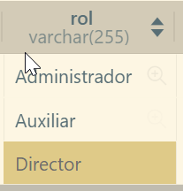

# Gestionamiento de Sistema ONG

## Problema
Una organización no gubernamental se encarga de enviar ayuda material (medicamentos y alimentos) y ayuda humanitaria (personal sanitario) a campos de refugiados. Esta organización obtiene sus ingresos de las cuotas de los socios, de los que se desea conocer los datos personales, la cuenta bancaria en donde se realizan los cargos anuales, la fecha de pago y el tipo de cuota. En la actualidad hay tres tipos de cuotas, pudiendo variar en el futuro: mínima (**10 US anuales**), media (**20 US anuales**) o máxima (**30 US anuales**).

Cada socio pertenece a una de las sedes de la organización, cada una de ellas ubicada en una ciudad distinta. De las sedes se desea conocer el domicilio y el nombre de su director. La organización cuenta con dos tipos de voluntarios: los que realizan labores humanitarias (personal sanitario) y los que realizan labores administrativas (personal administrativo). De los primeros se desea conocer su profesión (médico, ATS, etc.), su disponibilidad actual (sí/no) y el número de trabajos en los que ha participado. De todos los voluntarios se desea conocer los datos personales y la sede en la que se inscribieron.

Cada envío tiene un destino y una fecha de salida. Para identificar los envíos, se les asigna un código único. Además, cada envío es organizado por una o varias sedes. Los envíos de ayuda material pueden ser de alimentos, debiéndose conocer el número de toneladas de cada alimento que se manda; o pueden ser de medicamentos, debiéndose conocer el número de unidades de cada medicamento. De los envíos de ayuda humanitaria se debe conocer el número de voluntarios que se mandan de cada profesión (por ejemplo: 10 médicos, 20 ATS) y quienes son cada uno de ellos.

## Solución

Se requiere el desarrollo de una API RESTful con Spring Boot para administrar una organización no gubernamental (ONG) que se dedica a proporcionar ayuda material (medicamentos y alimentos) y ayuda humanitaria (personal sanitario) a campos de refugiados. La ONG obtiene sus ingresos de las cuotas de los socios y opera a nivel de múltiples sedes.

### Aplicaciones usadas

- **Visual Studio Code:**
    -Thunder Client
    -MySQL

- **NetBeans:**
    -Java
    -Springboot
    -JWT
    -JavaMail
    -se implementó Dto
    -ModelMapper
    -JUnit(pruebas unitarias)

## Resultados

### creación de usuarios

como se puede ver no se pueden crear usuarios, esto es debido a que un servidor está apagado o jwt ya que no es un administrador el que está creando el usuario, en ese caso tenemos que ingresar un usuario ya existente, hay dos metodos para crear el usuario por primera vez, pruebas unitarias e inserccion en la base de datos, en este caso el servidor está apagado!!

**Por base de datos es de la siguiente forma**

es tan simple como seleccionar la base de datos anteriormente creada y enfocarnos en la tabla de personas

como se puede ver solo es dar click en el boton de + para agregar una nueva fila y celda por celda ir editando el nuevo usuario, así es la forma para crear un usuario por primera vez en base de datos, recordar hacer al usuario con un rol de administrador para poder ingresar en cualquier lugar

esos serían los roles existentes en la base de datos uselos segun los roles para que algunos usuarios no puedan ingresar a ciertos enlaces y ver información confidencial

**Por JUnit es de la siguiente forma**

es tan sencillo como dirigirse al editor de codigo netbeans o visual en la carpesta de paquetes de testeos

cuando se encuentre en ese archivo simplemente es cambiar cada dato por lo que usted desea, recuerde respetar los parametros

en ese orden

y despues si el metodo es tan simple como correr el programa en el boton verde de play

como puede ver todo salió correctamente

con el usuario recién creado ya podremos iniciar al sistema para que nos autorizen un token de autenticación
