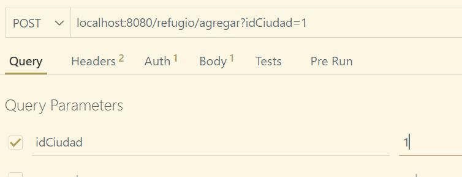

# Gestionamiento de Sistema ONG

## Problema
Una organización no gubernamental se encarga de enviar ayuda material (medicamentos y alimentos) y ayuda humanitaria (personal sanitario) a campos de refugiados. Esta organización obtiene sus ingresos de las cuotas de los socios, de los que se desea conocer los datos personales, la cuenta bancaria en donde se realizan los cargos anuales, la fecha de pago y el tipo de cuota. En la actualidad hay tres tipos de cuotas, pudiendo variar en el futuro: mínima (**10 US anuales**), media (**20 US anuales**) o máxima (**30 US anuales**).

Cada socio pertenece a una de las sedes de la organización, cada una de ellas ubicada en una ciudad distinta. De las sedes se desea conocer el domicilio y el nombre de su director. La organización cuenta con dos tipos de voluntarios: los que realizan labores humanitarias (personal sanitario) y los que realizan labores administrativas (personal administrativo). De los primeros se desea conocer su profesión (médico, ATS, etc.), su disponibilidad actual (sí/no) y el número de trabajos en los que ha participado. De todos los voluntarios se desea conocer los datos personales y la sede en la que se inscribieron.

Cada envío tiene un destino y una fecha de salida. Para identificar los envíos, se les asigna un código único. Además, cada envío es organizado por una o varias sedes. Los envíos de ayuda material pueden ser de alimentos, debiéndose conocer el número de toneladas de cada alimento que se manda; o pueden ser de medicamentos, debiéndose conocer el número de unidades de cada medicamento. De los envíos de ayuda humanitaria se debe conocer el número de voluntarios que se mandan de cada profesión (por ejemplo: 10 médicos, 20 ATS) y quienes son cada uno de ellos.

## Solución

Se requiere el desarrollo de una API RESTful con Spring Boot para administrar una organización no gubernamental (ONG) que se dedica a proporcionar ayuda material (medicamentos y alimentos) y ayuda humanitaria (personal sanitario) a campos de refugiados. La ONG obtiene sus ingresos de las cuotas de los socios y opera a nivel de múltiples sedes.

### Aplicaciones usadas

- **Visual Studio Code:**
    -Thunder Client
    -MySQL

- **NetBeans:**
    -Java
    -Springboot
    -JWT
    -JavaMail
    -se implementó Dto
    -ModelMapper
    -JUnit(pruebas unitarias)

## Resultados

### diagrama de base de datos

como se puede ver se diferencian en colores
ROJO: clases padre(no dependen de ninguna tabla)
VERDE CREMA: clases intermediarias(dependen de algunas tablas)
AMARILLO: clases totalmente hijas(siempre dependen de alguna tabla)

### creación de usuarios

como se puede ver no se pueden crear usuarios, esto es debido a que un servidor está apagado o jwt ya que no es un administrador el que está creando el usuario, en ese caso tenemos que ingresar un usuario ya existente, hay dos metodos para crear el usuario por primera vez, pruebas unitarias e inserccion en la base de datos, en este caso el servidor está apagado!!

**Por base de datos es de la siguiente forma**

 
es tan simple como seleccionar la base de datos anteriormente creada y enfocarnos en la tabla de personas

como se puede ver solo es dar click en el boton de + para agregar una nueva fila y celda por celda ir editando el nuevo usuario, así es la forma para crear un usuario por primera vez en base de datos, recordar hacer al usuario con un rol de administrador para poder ingresar en cualquier lugar

esos serían los roles existentes en la base de datos uselos segun los roles para que algunos usuarios no puedan ingresar a ciertos enlaces y ver información confidencial

**Por JUnit es de la siguiente forma**

es tan sencillo como dirigirse al editor de codigo netbeans o visual en la carpesta de paquetes de testeos

cuando se encuentre en ese archivo simplemente es cambiar cada dato por lo que usted desea, recuerde respetar los parametros

en ese orden

y despues si el metodo es tan simple como correr el programa en el boton verde de play

como puede ver todo salió correctamente

con el usuario recién creado ya podremos iniciar al sistema para que nos autorizen un token de autenticación

este seria el token que nos generan

al tener ya el token podremos hacer muchas mas funcionalidades como por ejemplo crear una ciudad en la base de datos

dejamos el token implementado para que nos dejen realizar la accion

ya al final solo es rellenar los datos necesarios

ya despues habrán algunos casos donde se necesiten parametros necesarios
como por ejemplo el refugio

estamos enviando los datos de la ciudad anteriormente agregada

no necesitamos enviar datos en el body por que no nos lo piden en el dto

como se puede ver solo tiene un id que ese es autoincremental y la ciudad, que es con el id que se relaciona el refugio

probablemente le salga algun error de autorización esto es debido a que dejó pasar mucho tiempo el token ya que este dura por solo algunos minutos, esrto por cuestiones de seguridad
pero simplemente es volver a iniciar y mandar el token

despues de enviar el token ya de forma correcta nos permitirá crear el refugio ya creado

siendo nosotros administradores se nos permite ver el listado de todos los usuarios

# para hacer pruebas con thunder client

## instalar thunder client en visual studio code como una extension

yo lo recomiendo bastante

en el archivo del programa dejé una colecciones de thunder client
su modo de uso es el siguiente

## organizar archivos
se hace la importacion en las colecciones y esa es la ultima colleccion que tengo guardada, mas sin embargo usted mismo puede hacer mas carpetas e ir probando el programa
en las colecciones que compartí se encuentran las carpetas junto con los request que eh probado hasta el momento

ya despues de eso puede empezar a hacer muchas mas pruebas

# Continuación de Pruebas

eso es todo por la documentacion de hoy
**El proyecto ya está completamente terminado lo que no están es todas las pruebas, estan hechas pero no las eh probado,estoy seguro que funcionan sin ningun problema, mas sin embargo seguiré implementando metodos de uso ya que soy el que mejor conoce este programa, ahorita mismo no eh hecho todas las pruebas del programa y las iré probando poco a poco ya que son muchas tablas que fueron creadas y también iré mostrando las pruebas por aquí**